<p align="center">
  
</p>

# MultiverseProgramming

Programmable computers, autonomous robotic turtles, and automation peripherals with **Lua 5.2** inside your Minecraft server, inspired by ComputerCraft and built natively for high-performance Paper/Purpur architectures.

Part of **Chagui68's Sovereign Multiverse Ecosystem** alongside [MultiverseNets](https://github.com/DrakesCraft-Labs/MultiverseNets) and [MultiverseCreatures](https://github.com/DrakesCraft-Labs/MultiverseCreatures).

Place a computer or turtle in the world, insert a **floppy disk**, and validate & execute your Lua code with one click — or orchestrate large-scale automated construction remotely via the **Blueprint Nexus Web Portal**.

Built and verified for **Purpur / Paper 1.21.11** with **Java 21**.

[](https://drakescraft-labs.github.io/MultiverseProgramming/)
[](https://www.oracle.com/java/)
[](https://coreprotect.net/)
[](LICENSE)

> 📖 **Wiki**: [English](wiki/en/Home.md) · [Español](wiki/es/Home.md)  
> 🌐 **Web Portal**: [Launch Blueprint Nexus](https://drakescraft-labs.github.io/MultiverseProgramming/)

---

## 🌟 Sovereign Multiverse Architecture

`MultiverseProgramming` is part of a dedicated trio of standalone, high-performance plugins engineered by **Chagui68**:
1. **MultiverseProgramming:** Lua runtime, robotic turtles, peripherals, and blueprint dispatching.
2. **[MultiverseNets](https://github.com/DrakesCraft-Labs/MultiverseNets):** Standalone digital logistics, item transport cables, and mass storage matrices (independent of Slimefun).
3. **[MultiverseCreatures](https://github.com/DrakesCraft-Labs/MultiverseCreatures):** Mythic entities, cinematic panteon boss fights, and adaptive battle AI.

---

## Features

### 🐢 Programmable Turtle & Autonomous Builder
- **Mobile Robotic Agent**: Navigates 3D space (forward, back, up, down, turn left/right), inspects blocks, digs, places, sucks, and drops items.
- **Anti-Lag Blueprint Builder**: Autonomous building engine that constructs `.litematic` and vanilla structure `.nbt` files block-by-block with tick pacing without causing server lag spikes.
- **3D Rotation & Orientation**: Build structures in any horizontal orientation (`NORTH`, `EAST`, `SOUTH`, `WEST` or `0°`, `90°`, `180°`, `270°`) with automated coordinate transformation and blockstate rotation.
- **Supply & Fuel Chests with Holograms**: When materials or fuel are depleted, the turtle spawns adjacent temporary chests with floating holograms (`"Place construction blocks here"` / `"Place fuel here"`), pulling items automatically.
- **Container & Dupe Protection**: Strict security filters prevent storing nested shulker containers and writable books inside constructed containers.

### 🛡️ CoreProtect Auditing & Security Protection
- **Full CoreProtect Attribution**: Every block placed, dug, or cleared by an autonomous turtle is logged via soft-reflection through `CoreProtectBridge`, attributing the action directly to the player who owns or dispatched the turtle.
- **Zero Untraceable Griefing**: Staff can inspect (`/co i`) any block touched by a turtle and instantly view the responsible player's username.
- **Claim Protection Integration**: Complete compatibility with **WorldGuard** and **ProtectionStones** to prevent unauthorized construction in protected plots. Configurable owner-only policy (`protection-stones-require-owner`).

### 🌐 Blueprint Nexus Web Portal
- **Online Visualizer & Dispatcher**: Hosted globally via GitHub Pages at [`https://drakescraft-labs.github.io/MultiverseProgramming/`](https://drakescraft-labs.github.io/MultiverseProgramming/) and served locally by your server on port `8080`.
- **Drag & Drop Upload**: Upload `.litematic` and vanilla structure `.nbt` files directly from your web browser.
- **Storage Quotas & Pastebin Cloud**: Global and personal storage quota limits per player with administrative bypass (`/mvprog getbypass`).
- **Remote Construction Dispatch**: Target any active turtle in your world and dispatch autonomous construction at specified X, Y, Z coordinates and orientation.

### 🖥️ Computers & Advanced Computers
- **Standard Computer Block** (default: lectern): Right-click GUI, insert floppy disk, validate syntax, and run Lua code with in-game chat output.
- **Advanced Computer** (default: enchanting table): Persistent state, long-running loops, and a **dynamic Stop Button**:
  - Displays a green emerald (`▶ Run Program`) when idle.
  - Transforms into a glowing redstone block (`⏹ Stop Program`) while running.
  - Allows interrupting execution at any time, even after ejecting the disk.
- **Machine Crafting & Functionality Toggles**: Granular toggles in `config.yml` to enable/disable crafting recipes and runtime functionality for each machine block.

### 🔌 Advanced Automation Peripherals & Machines
- **Display Monitor** (`monitor`): Render multiline text, ASCII banners, and RGB colors on adjacent sign monitors.
- **Auto-Crafter** (`crafter`): Programmatic 3x3 recipe crafting, ingredient validation, and recipe querying.
- **Inventory Transposer** (`transposer`): Automated item routing, precise stack transfer, and container sorting between adjacent chests.
- **Sound Synthesizer** (`speaker`): Play custom note block melodies, instruments, tones, and octaves directly via Lua.
- **Block & Entity Scanner** (`scanner`): Scans nearby living entities and players (health, distance, coordinates) and searches surrounding blocks by material filter.
- **Cartographer & Map Renderer** (`cartographer`): Geographic radar, biome query, vanilla map creation (`FILLED_MAP`), and ASCII topography monitor projection.
- **Potion & Alchemical Synthesizer** (`alchemist`): Automated brewing stand queries, recipe synthesis directly from adjacent containers, modifier and splash support.
- **Farming / Harvesting Module** (`farmer`): Inspects crop maturity, auto-harvests mature crops, replants seeds, and fertilizes with bone meal from adjacent chests.
- **Quarry Engine / Excavator Upgrade** (`quarry` & Turtle upgrade): Autonomous layer-by-layer excavation ($W \times L$ down to target $Y$). Can be attached laterally to a Turtle as a mobile upgrade module (travels in lockstep with the turtle, automatically deploys holographic fuel & storage chests, auto-pauses when storage fills up, and consumes 20% more fuel).
- **NPC Chatbot & Quest Interposer** (`npc`): Interactive NPC dialogues, chat choice menus, floating TextDisplay holograms, and player interaction responses.

---

## Quick Start

1. Drop `MultiverseProgramming-1.0.8.jar` into your server's `plugins/` folder and start the server.
2. Craft a **Floppy Disk** (see [Recipes](wiki/en/Recipes.md)) — fresh disks come preloaded with template code.
3. Place a **Turtle** or **Computer** and right-click to open its interface.
4. Insert your disk into the drive slot and click **"✔ Validate Code"** or **"▶ Run Program"**.
5. Connect your browser to the [Blueprint Nexus Web Portal](https://drakescraft-labs.github.io/MultiverseProgramming/) to upload designs and dispatch construction tasks!

### Example Lua Construction Program

```lua
-- Start autonomous construction at relative coordinates (0, 0, 0 for current position) with 90-degree rotation (facing EAST)
local ok, err = turtle.build("BP-CASTLE", 0, 0, 0, false, "EAST")
if not ok then
  print("Build error: " .. err)
else
  print("Construction started successfully!")
end
```

---

## Commands

All commands use the `/mvprog` prefix (aliases: `/pc`, `/computador`, `/computadora`, `/disco`):

```text
/mvprog help                                                     - Shows help menu
/mvprog web                                                      - Shows Web Dashboard link
/mvprog get <code|url>                                           - Downloads blueprint from cloud nexus
/mvprog quota [player]                                           - Views personal or target player storage quota
/mvprog bp [list|quota|delete]                                   - Manages personal blueprints
/mvprog build <bp> <x> <y> <z> [turtle] [clear] [orientation]   - Orders turtle to construct (Admin)
/mvprog getbypass <code|url>                                     - Downloads blueprint bypassing quota (Admin)
/mvprog bp clean [days]                                          - Purges unpinned blueprints (Admin)
/mvprog give <item>                                              - Gives custom item (Admin)
/mvprog reload                                                   - Reloads configuration and recipes (Admin)
```

---

## 🛠️ Developer Documentation & Architecture Guide

Comprehensive technical documentation is available for contributors, developers, and server administrators:
- 🇬🇧 **[English Developer Hub](wiki/en/dev/README.md)**
  - [Core Architecture & Subsystems](wiki/en/dev/Architecture.md)
  - [Web Portal & Communication Bridge](wiki/en/dev/Web-Portal-and-Bridge.md)
  - [Turtles, Quarry Engine & Peripherals](wiki/en/dev/Turtles-and-Peripherals.md)
- 🇪🇸 **[Centro de Desarrolladores en Español](wiki/es/dev/README.md)**
  - [Arquitectura del Núcleo y Subsistemas](wiki/es/dev/Arquitectura.md)
  - [Portal Web y Puente de Comunicación](wiki/es/dev/Portal-Web-y-Puente.md)
  - [Tortugas, Motor de Cantera y Periféricos](wiki/es/dev/Tortugas-y-Perifericos.md)

---

## Building from Source

```bash
mvn -q clean package
```

The compiled shaded jar with all bundled dependencies (Luaj, shaded) will be generated in `target/MultiverseProgramming-1.0.8.jar`.

---

## License

This project is licensed under the **GNU General Public License v3.0**. See [LICENSE](LICENSE) for details.
